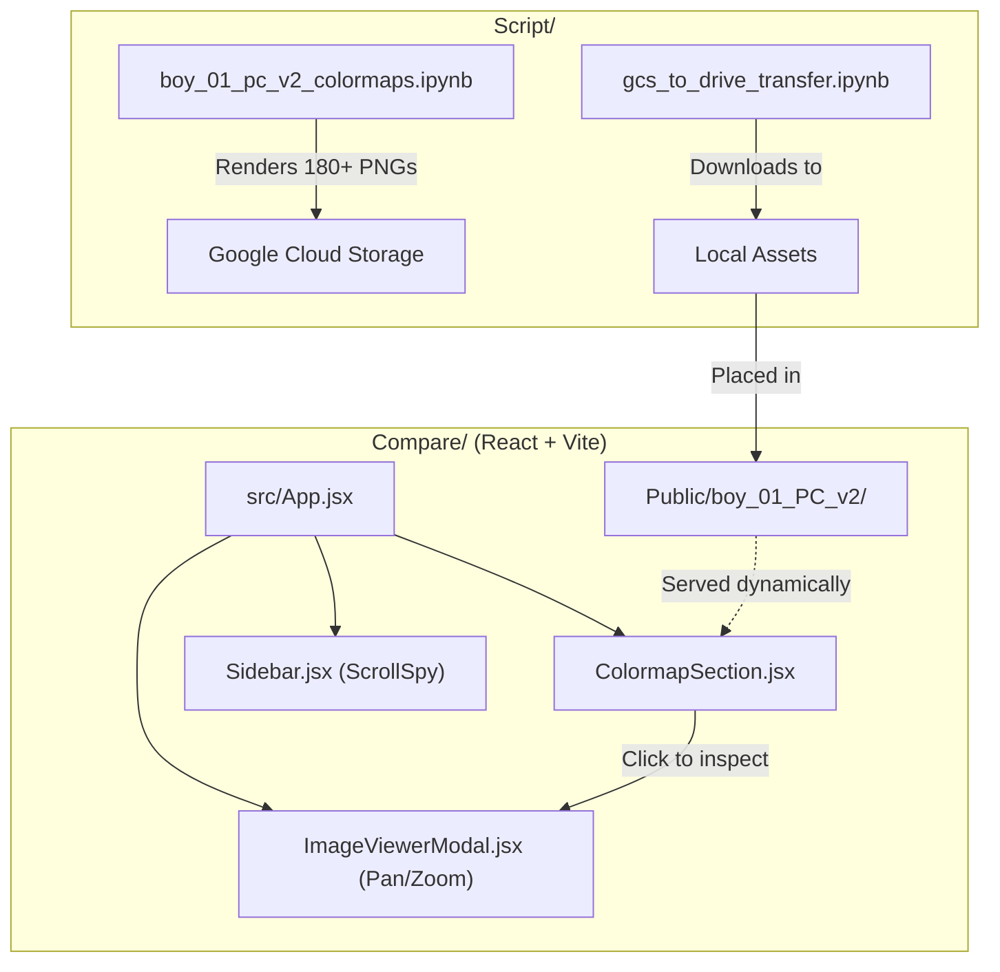

# 🎨 Colormap Catalog Website

> An interactive React web application for browsing and comparing 180+ point cloud colormap visualizations.

📂 **Parent**: [PyBlender](../README.md)

---

## 📖 Overview

This directory contains the **Colormap Catalog Website**, a static frontend tool used to visually inspect how different matplotlib colormaps (e.g., turbo, viridis, magma) affect the visualization of distance errors on 3D point clouds.

The directory is split into two primary components:
1. **`Compare/`**: The frontend React web application.
2. **`Script/`**: The scripts and notebooks used to bulk-generate the image assets.

---

## 🏗️ Architecture & Structure



### 1. The Web Application (`Compare/`)
- Built with **React 18** and **Vite**.
- Styled with raw CSS variables for a lightweight footprint.
- Features a dynamic **ScrollSpy** sidebar for easy navigation.
- Includes a custom-built, full-screen **Pan/Zoom Modal** to inspect point cloud details at pixel level.
- Designed to be deployed directly to **Cloudflare Pages** (to bypass GitHub's repository size limits for large image datasets).

### 2. The Generation Scripts (`Script/`)
- Jupyter notebooks configured to bulk-render every available matplotlib colormap.
- Utility scripts (`gcs_to_drive_transfer.py`) to manage the movement of massive amounts of rendered PNGs from Cloud Storage buckets to local environments.

---

## 🚀 Running the Website Locally

You can spin up the catalog website on your local machine to inspect the results.

### Prerequisites
- [Node.js](https://nodejs.org/) installed (v16 or higher).
- Rendered images must be placed inside `Compare/Public/boy_01_PC_v2/` (these are git-ignored due to size).

### Setup & Run

1. Navigate to the frontend directory:
   ```bash
   cd Compare
   ```

2. Install the necessary NPM dependencies:
   ```bash
   npm install
   ```

3. Start the Vite development server:
   ```bash
   npm run dev
   ```

4. Open your browser to `http://localhost:5173`.

---

## ☁️ Deployment Strategy

Because the image assets total several gigabytes in size, the repository cannot be pushed directly to GitHub with the images included. 

We utilize **Cloudflare Pages** for direct-to-CDN deployment:

```bash
# Inside the Compare/ directory
npm run build
npx wrangler pages deploy dist
```
*Note: You must have the Cloudflare Wrangler CLI authenticated on your machine.*
