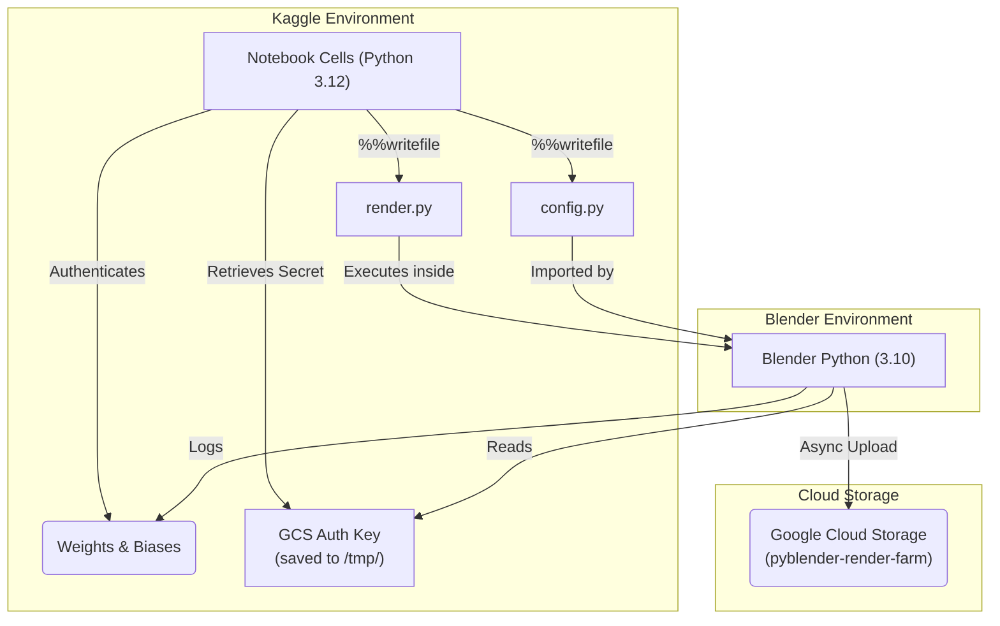

# 🚀 Kaggle Scripts — High-Performance Cloud Rendering

> Automated, GPU-accelerated rendering pipelines optimized for Kaggle notebooks.

📂 **Parent**: [PyBlender](../README.md)

---

## 📖 Overview

The `Kaggel_Script/` directory contains highly optimized Python scripts and Jupyter notebooks designed to run rendering workloads natively on Kaggle's infrastructure. 

These scripts utilize Blender 4.0 embedded Python combined with GPU acceleration (OptiX denoiser) to bring rendering times from ~17s per frame down to **~2.3s per frame**.

### Why Kaggle?
- Free access to dual T4 GPUs.
- Native integration with Google Cloud Storage (GCS) and Weights & Biases (WandB).
- Massively parallel capabilities for huge datasets.

---

## 🏗️ Architecture

Rendering in Kaggle presents a unique challenge: Blender brings its own isolated Python environment (Python 3.10), which cannot natively access Kaggle's default system Python (Python 3.12) or `kaggle_secrets`.

To bridge this gap, we use a hybrid environment model:

---

## 📂 Included Notebooks

| Notebook | Description |
|---|---|
| `boy_01_pc_v2_colormaps.ipynb` | The main, highly optimized script for rendering `.xyz` point clouds with 168+ colormaps. Pre-computes KD-tree distances to maximize GPU speed. |
| `master-ply-renderer-kaggle-tpu-cpu-mode.ipynb` | Generalized script for rendering full triangle `.ply` meshes. |
| `gcs_to_drive_transfer.ipynb` | Utility notebook for quickly copying large render batches from GCS buckets back to your Google Drive. |
| `render_ply.py` | Standalone Python version of the PLY rendering script. |

---

## ⚙️ GPU Optimizations

We rely on several critical Blender configurations inside `render.py` to maximize performance on Kaggle's dual T4 GPUs:

- **OptiX Denoiser**: Bypasses the CPU-based compositing denoiser, heavily accelerating post-processing.
- **Persistent Data**: Maintains the BVH tree in VRAM between sequential frame renders.
- **256px Tiles**: Optimized render tile size for modern NVIDIA GPUs.
- **Disabling CPU**: Actively detects and removes the CPU from the device execution list to prevent rendering bottlenecks.

---

## 🚀 Setup & Execution (Kaggle)

If you intend to run this on your own Kaggle account, you must configure secrets:

1. **Upload Data**: Create a Kaggle Dataset containing your `.xyz` or `.ply` files (e.g. `pyblender-pointclouds`).
2. **Add Kaggle Secrets**:
   - `WANDB_API_KEY`: Your Weights and Biases authentication key.
   - `GCS_SERVICE_ACCOUNT_KEY`: A JSON service account key for your Google Cloud Storage bucket (requires *Storage Object Admin* role).
3. **Run All**: Hit "Run All" on the notebook. The script handles dependencies, paths, and Blender setup automatically!
